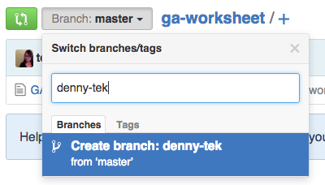
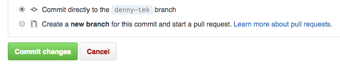
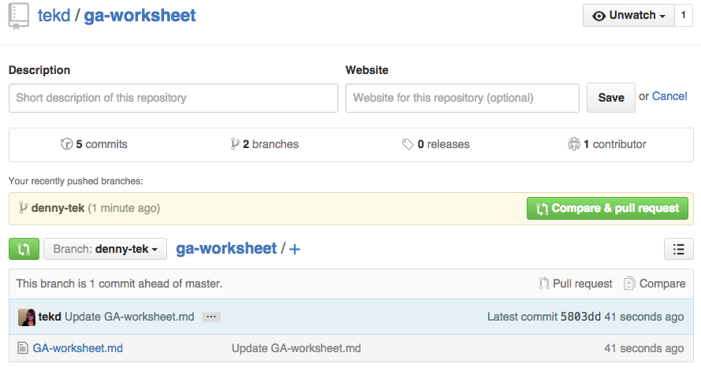
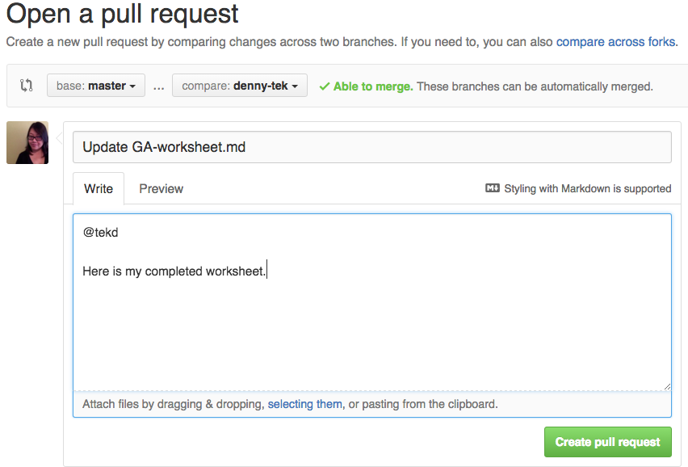

### Worksheet Instructions

1. Fork this repo and click on your worksheet to open it.

2. Create a branch with your name.

    

   

3. Click 'Edit' and type in your responses.

    ![step3-edit] (img/step3-edit.png)

4. Commit changes to save your work. You can always go back to it and edit it.

    

####When you're ready to submit your work:

5. Go back to the main worksheet folder and click on the big green button that says 'Compare & Pull Request'.

    

6. Leave a commit message in the body and tag your instructor using their GitHub username, i.e. @tekd.

    

7. Click on 'Create pull request' at the bottom.

8. You're done! You''ll be redirected to page that shows you your pull request.

**DO NOT CLICK THIS BUTTON! **
   

